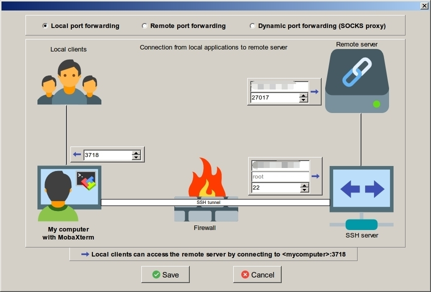
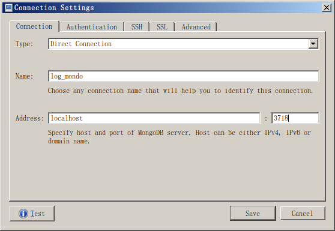
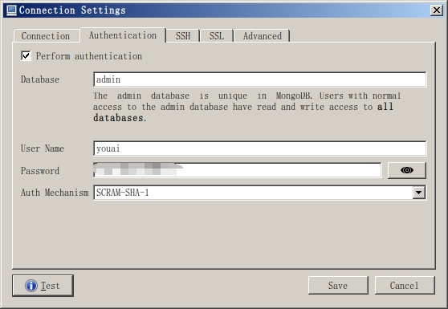

# 使用MongoDB记录公共SDK日志

## 起因

整个公共SDK服务其实是由多个主机上的python进程提供的：首先是访问域名的时候经过负载均衡，请求转发到某个主机上，主机上的nginx再负载均衡到某个python进程上，**一个python进程记录一个日志文件**，这样所有日志其实是分散的，出问题的时候难以快速定位到日志，而且日志越来越大，grep需要的时间也越来越多。

## 思路

使用mongodb记录**失败的日志信息**，把判断需要用到的数据放到文档中，通过查询定位到日志信息。同时保留策略为5天，5天前的失败记录自动删除。

## 计划

1. 安装部署mongodb
2. 分析日志数据，确定需要存储的数据内容和文档格式
3. 编码实现，注意即使mongodb不使用或者异常，都不能影响到已经上线的程序运行
4. 测试，修正
5. 试用，看看效果如何

## 安装部署mongodb

安装的具体过程略。。。

mongodb安装在`127.0.0.1`

* 配置文件：/etc/mongod.conf
* 数据路径：/data/mongodb
* 启动方式：service mongod start
* 停止方式：service mongod stop
* 登陆方式：mongo --authenticationDatabase admin -u root -p root

## 分析日志数据

日志分登陆验证，创建订单和支付通知三类，主要是前后两个接口。

### 登陆日志

    [2018-08-07 16:51:51]  INFO pid:18400 port:4005 server.py:274  POST /logincheck/check (123.131.144.219) login request ----------------:
        login_data:{u'gv': u'2.12.0', u'sdkVersionCode': u'V1_0', u'timestamp': u'1533631911783', u'sdkSimpleName': u'okwan', u'di': u'd66a0cc4ee139853c88203be1bb1e916*kwutq1533631675069', u'sign': u'E0MIHgVMUkdUWkJFRwEFTU1UVlpBU1ZCRUYBDApVW19dRldZXVUAWVBDVRIHDxtGVUxfAFFVCUJVWFAWBwxWUQBaVVwVWFoOR1IMX1ECDgJeR0MT', u'userType': u'385', u'imei': u'666660281218640', u'other': u'', u'rl': u'1024*576', u'c2': u'', u'c1': u'', u'ot': u'tencent|virtual machine 2|4.4.2|unknown', u'nt': u'WIFI', u'openId': u'', u'gameSimpleName': u'dht_hb'}
        serverConfig:{u'appKey': u'2c7d81e95f243f9fa9cff91c863926cc', u'apiKey': u'c6bb36eb341cfe7ab41c14e32dec9af1'}
    [2018-08-07 16:51:51]  INFO pid:18400 port:4005 connectionpool.py:214  Starting new HTTP connection (1): api.m.okwan.com
    [2018-08-07 16:51:52]  INFO pid:18400 port:4005 server.py:300  POST /logincheck/check (123.131.144.219) login result_data ----------------:
        (0, 'success', 582479)

### 支付通知日志

#### 成功发货的日志

get方式请求

    [2018-08-13 10:51:34]  INFO pid:28330 port:5004 server.py:366  GET /paycheck/confirm/shqyj2/cs9377juhe/V1_0_3?order_id=201808131051183918&username=883361533&server_id=528&money=68&extra_info=201808131051145469210ADD&time=1534128693&sign=a16071aff09f6176e2e1cbbe5774c1f4&sandbox=0 (113.107.150.34) confirm request ----------------:
        serverConfig:{u'Key': u'1869eb1d7f36fef321b2e9c488ef1379'}
        parmags:
        {'username': ['883361533'], 'server_id': ['528'], 'order_id': ['201808131051183918'], 'money': ['68'], 'sign': ['a16071aff09f6176e2e1cbbe5774c1f4'], 'sandbox': ['0'], 'time': ['1534128693'], 'extra_info': ['201808131051145469210ADD']}
        body:
    
    [2018-08-13 10:51:34]  INFO pid:28330 port:5004 server.py:386  GET /paycheck/confirm/shqyj2/cs9377juhe/V1_0_3?order_id=201808131051183918&username=883361533&server_id=528&money=68&extra_info=201808131051145469210ADD&time=1534128693&sign=a16071aff09f6176e2e1cbbe5774c1f4&sandbox=0 (113.107.150.34) confirm result ----------------:
        {'order_id': u'201808131051183918', 'amount': 68.0, 'query_id': u'201808131051145469210ADD', 'remark': 'success', 'result_msg': '{"state":1,"msg":"\xe6\x88\x90\xe5\x8a\x9f"}'}
    [2018-08-13 10:51:34]  INFO pid:28330 port:5004 server.py:568  GET /paycheck/confirm/shqyj2/cs9377juhe/V1_0_3?order_id=201808131051183918&username=883361533&server_id=528&money=68&extra_info=201808131051145469210ADD&time=1534128693&sign=a16071aff09f6176e2e1cbbe5774c1f4&sandbox=0 (113.107.150.34) callback request ----------------:
        https://shyaqyj3dplatformapi.yyxxgame.com/shya/recharge.php?orderId=201808131051183918&postTime=1534128674&uId=883361533&userType=237&playerId=52701476&sdkSimpleName=cs9377juhe&sign=270813237c592885f88a1cf1cd7f14cb&payType=&custom=shya%2C210001%2C528%2C52701476%2C014052800527014761534128673415%2C1%2Chttps%3A%2F%2Fshyaqyj3dplatformapi.yyxxgame.com%2Fshya%2Frecharge.php&goodsName=680%E5%85%83%E5%AE%9D&currency=CNY&goodsId=com.junhai.qyj.pay68&queryId=201808131051145469210ADD&remoteIp=223.104.2.202&serverSign=a56d41ef5e84a7338dec97c885d824ff&serverId=528&gameSimpleName=shqyj2&payTime=1534128694&payAmount=68.0
    [2018-08-13 10:51:34]  INFO pid:28330 port:5004 server.py:574  GET /paycheck/confirm/shqyj2/cs9377juhe/V1_0_3?order_id=201808131051183918&username=883361533&server_id=528&money=68&extra_info=201808131051145469210ADD&time=1534128693&sign=a16071aff09f6176e2e1cbbe5774c1f4&sandbox=0 (113.107.150.34) callback response ----------------:
        {"code":1,"message":"OK"}
    [2018-08-13 10:51:34]  INFO pid:28330 port:5004 server.py:465  GET /paycheck/confirm/shqyj2/cs9377juhe/V1_0_3?order_id=201808131051183918&username=883361533&server_id=528&money=68&extra_info=201808131051145469210ADD&time=1534128693&sign=a16071aff09f6176e2e1cbbe5774c1f4&sandbox=0 (113.107.150.34) confirm result_msg----------------:
        {"state":1,"msg":"成功"}

post方式请求

    [2018-08-13 10:51:35]  INFO pid:28330 port:5004 server.py:366  POST /paycheck/confirm/qyz_rw/uc/V6_1_0 (14.116.140.157) confirm request ----------------:
        serverConfig:{u'apiKey': u'be1c4bee25b0d711c7071a8dd21bde51', u'serverId': u'0', u'gameId': u'769287', u'channelId': u'1', u'cpId': u'78098'}
        parmags:
        {}
        body:
        {"ver":"2.0","data":{"gameId":"769287","accountId":"d93fac9464264f17708652a19fec9edb","creator":"ALI","amount":"6.00","orderId":"20180813105053101215","failedDesc":"","callbackInfo":"20180813105050471473CD6B","payWay":"999","orderStatus":"S"},"sign":"add06475b6be559bc8319b4c2b827a78"}
    [2018-08-13 10:51:35]  INFO pid:28330 port:5004 server.py:386  POST /paycheck/confirm/qyz_rw/uc/V6_1_0 (14.116.140.157) confirm result ----------------:
        {'order_id': u'20180813105053101215', 'server_id': 0, 'query_id': u'20180813105050471473CD6B', 'open_id': u'd93fac9464264f17708652a19fec9edb', 'player_id': 0, 'remark': u'ALI : ', 'result_msg': 'SUCCESS', 'amount': 6.0}
    [2018-08-13 10:51:35]  INFO pid:28330 port:5004 server.py:568  POST /paycheck/confirm/qyz_rw/uc/V6_1_0 (14.116.140.157) callback request ----------------:
        https://yaqyjrecharge.yyxxgame.com/?orderId=20180813105053101215&postTime=1534128650&uId=d93fac9464264f17708652a19fec9edb&userType=34&playerId=1146204524&sdkSimpleName=uc&sign=aff7745597e9fef3fb0af5670924ffaf&payType=&custom=operator%3Dxwrw%26server_id%3D3147%26player_id%3D1146204524%26cp_order_id%3D020314711462045241534128649984%26dext%3D2&goodsName=60%E5%85%83%E5%AE%9D&currency=CNY&goodsId=2&queryId=20180813105050471473CD6B&remoteIp=180.107.32.126&serverSign=bf4fef01783838119fedc644c704bcad&serverId=3147&gameSimpleName=qyz_rw&payTime=1534128695&payAmount=6.0
    [2018-08-13 10:51:35]  INFO pid:28330 port:5004 server.py:574  POST /paycheck/confirm/qyz_rw/uc/V6_1_0 (14.116.140.157) callback response ----------------:
        {"code":1,"message":"\u5145\u503c\u6210\u529f"}
    [2018-08-13 10:51:35]  INFO pid:28330 port:5004 server.py:465  POST /paycheck/confirm/qyz_rw/uc/V6_1_0 (14.116.140.157) confirm result_msg----------------:
        SUCCESS
    [2018-08-13 10:51:35]  INFO pid:28330 port:5004 web.py:1908  200 POST /paycheck/confirm/qyz_rw/uc/V6_1_0 (14.116.140.157) 293.16ms

#### 支付通知成功但是发货失败日志

    [2018-08-09 19:17:46]  INFO pid:14686 port:5007 server.py:366  POST /paycheck/confirm/shyaqyj2A13/qiyu/V1_1 (118.25.138.225) confirm request ----------------:
        serverConfig:{u'pay_key': u'a8ce53616315028f9e93db793714cf16', u'app_id': u'100386'}
        parmags:
        {'billno': ['201808091917321261941F55'], 'orderId': ['201808091917324168107'], 'orderTime': ['1533813465'], 'uid': ['qy4804569'], 'extraInfo': ['201808091917321261941F55'], 'sign': ['9e88a37ca908c28bd7a9bd9badb35e64'], 'amount': ['6'], 'test': ['0'], 'serverId': ['390']}
        body:
        billno=201808091917321261941F55&orderId=201808091917324168107&uid=qy4804569&amount=6&serverId=390&sign=9e88a37ca908c28bd7a9bd9badb35e64&extraInfo=201808091917321261941F55&test=0&orderTime=1533813465
    [2018-08-09 19:17:46]  INFO pid:14686 port:5007 server.py:386  POST /paycheck/confirm/shyaqyj2A13/qiyu/V1_1 (118.25.138.225) confirm result ----------------:
        {'order_id': u'201808091917324168107', 'amount': 6.0, 'query_id': u'201808091917321261941F55', 'remark': 'success', 'result_msg': 'success'}
    [2018-08-09 19:17:46]  INFO pid:14686 port:5007 server.py:567  POST /paycheck/confirm/shyaqyj2A13/qiyu/V1_1 (118.25.138.225) callback request ----------------:
        https://shyaqyj3dplatformapi.yyxxgame.com/shya/recharge.php ?orderId=201808091917324168107&postTime=1533813452&uId=qy4804569&userType=148&playerId=38901854&sdkSimpleName=qiyu&sign=6b36d3e6a472401d7e66d20732475c97&payType=&custom=shya%2C180006%2C390%2C38901854%2C014039000389018541533813450904%2C1%2Chttps%3A%2F%2Fshyaqyj3dplatformapi.yyxxgame.com%2Fshya%2Frecharge.php&goodsName=60%E5%85%83%E5%AE%9D&currency=CNY&goodsId=com.junhai.qyj.pay6&queryId=201808091917321261941F55&remoteIp=116.22.34.220&serverSign=dec6247364a95f9e43d36375e276b56b&serverId=390&gameSimpleName=shyaqyj2A13&payTime=1533813466&payAmount=6.0
    Traceback (most recent call last):
      File "/data/www/sdk_validator_server/server.py", line 570, in callback_to_game
        rsp = urllib2.urlopen(post_url,post_data,timeout=16)
      File "/usr/local/lib/python2.7/urllib2.py", line 127, in urlopen
        return _opener.open(url, data, timeout)
      File "/usr/local/lib/python2.7/urllib2.py", line 410, in open
        response = meth(req, response)
      File "/usr/local/lib/python2.7/urllib2.py", line 523, in http_response
        'http', request, response, code, msg, hdrs)
      File "/usr/local/lib/python2.7/urllib2.py", line 448, in error
        return self._call_chain(*args)
      File "/usr/local/lib/python2.7/urllib2.py", line 382, in _call_chain
        result = func(*args)
      File "/usr/local/lib/python2.7/urllib2.py", line 531, in http_error_default
        raise HTTPError(req.get_full_url(), code, msg, hdrs, fp)
    HTTPError: HTTP Error 404: Not Found
    [2018-08-09 19:17:46]  INFO pid:14686 port:5007 server.py:465  POST /paycheck/confirm/shyaqyj2A13/qiyu/V1_1 (118.25.138.225) confirm result_msg----------------:
        201808091917321261941F55 callback to game error HTTP Error 404: Not Found
    [2018-08-09 19:17:46]  INFO pid:14686 port:5007 web.py:1908  200 POST /paycheck/confirm/shyaqyj2A13/qiyu/V1_1 (118.25.138.225) 187.47ms

#### 支付通知验证未通过日志

    [2018-08-13 10:52:02]  INFO pid:28330 port:5004 server.py:366  POST /paycheck/confirm/qyqyj20/qiyu_ios/V1_2 (118.25.138.225) confirm request ----------------:
        serverConfig:{u'pay_key': u'4e67dc76de4f2686b11f90149ba5f79a', u'app_id': u'100384'}
        parmags:
        {'billno': ['201808131046290868953CC9'], 'orderId': ['201808131046295615816'], 'orderTime': ['1534128495'], 'uid': ['qy4804063'], 'extraInfo': ['201808131046290868953CC9'], 'sign': ['dafd1cf614c510b7bfc0c514ad8bfa98'], 'amount': ['6'], 'test': ['0'], 'serverId': ['9921']}
        body:
        billno=201808131046290868953CC9&orderId=201808131046295615816&uid=qy4804063&amount=6&serverId=9921&sign=dafd1cf614c510b7bfc0c514ad8bfa98&extraInfo=201808131046290868953CC9&test=0&orderTime=1534128495
    201808131046295615816qy480406399216201808131046290868953CC91534128495201808131046290868953CC904e67dc76de4f2686b11f90149ba5f79a
    b03984d8965e90ffb1e4e89a952d0f42 dafd1cf614c510b7bfc0c514ad8bfa98
    [2018-08-13 10:52:02]  INFO pid:28330 port:5004 server.py:386  POST /paycheck/confirm/qyqyj20/qiyu_ios/V1_2 (118.25.138.225) confirm result ----------------:
        {'order_id': '', 'amount': '', 'query_id': '', 'remark': 'fail', 'result_msg': ''}
    [2018-08-13 10:52:02]  INFO pid:28330 port:5004 server.py:465  POST /paycheck/confirm/qyqyj20/qiyu_ios/V1_2 (118.25.138.225) confirm result_msg----------------:
        not query_id or order id
    [2018-08-13 10:52:02]  INFO pid:28330 port:5004 web.py:1908  200 POST /paycheck/confirm/qyqyj20/qiyu_ios/V1_2 (118.25.138.225) 31.11ms

## 确定文档格式

* mongodb结构：
    * 数据库名：log_login
    * 集合：log_login和log_pay

### 文档共有部分

```
url = request.protocol + "://" + request.host

document = {
    'ip': request.remote_ip,     # 请求方IP地址
    'method': request.method,    # 请求方式：GET/POST等
    'url': url + request.uri,    # 完整的url，便于自己调试

    "gamename": handler.game_code,              # 游戏简称
    "sdkname": handler.sdk_code,                # sdk简称
    "sdkversion": handler.sdk_version_name,     # sdk版本

    'config': config,           # 服务端参数
    'returns': returns,         # 接口执行后的返回值

    "create_time": str(datetime.datetime.now())[:19],  # 文档创建时间，用于定时清理记录
}
```

### log_login独有部分

```
data = {
    'openId': login_data.get('openId', ''),
    'sign': login_data.get('sign', ''),
    'other': login_data.get('other', ''),
    'timestamp': login_data.get('timestamp', '')
}

document['data'] = data
document.update(**data)
```

### log_pay独有部分

```
document['body'] = body
document['arguments'] = arguments

document['result_msg'] = result_msg
document['pay_status'] = pay_status
document['remark'] = remark

document['query_id'] = query_id
document['order_id'] = order_id
```

## 编码实现

使用第三方库：`pymongo`

代码详见：[log_mongo.py](log_mongo.py)

注意：全局变量`_DEBUG`为`False`则记录document到文件，不记录到数据库，为`True`才记录到数据库。

## 如何查询日志

* 一般的查询：`db.getCollection('log_login').find({})`
* 倒序：`db.getCollection('log_login').find({}).sort({'create_time':-1})`
* 根据openId查找登陆日志：`db.getCollection('log_login').find({'openId': '2711643'})`
* 根据订单号查找支付日志：`db.getCollection('log_pay').find({'query_id': '20180808080808xxx'})`
* 正则匹配：`db.getCollection('log_pay').find({'body':{$regex: 'C767FF913DD81A24386DADEB66848197'}}).sort({'create_time':-1})`

### 使用客户端工具





## 利用TTL索引自动删文档

参考：[TTL索引自动删文档](https://blog.csdn.net/jianlong727/article/details/54631124)

```
> db.log_login.createIndex( { "create_time": 1 }, { expireAfterSeconds: 5*24*60*60 } )
{
        "createdCollectionAutomatically" : true,
        "numIndexesBefore" : 1,
        "numIndexesAfter" : 2,
        "ok" : 1
}

> db.log_pay.createIndex( { "create_time": 1 }, { expireAfterSeconds: 5*24*60*60 } )
{
        "createdCollectionAutomatically" : true,
        "numIndexesBefore" : 1,
        "numIndexesAfter" : 2,
        "ok" : 1
}
```

## 有什么缺点

登陆日志还好用，之前的日志系统，登陆失败了，是几乎不能找到日志，现在精确查找可以根据openId、timestamp、token等，模糊查找根据游戏简称和sdk简称就可以看到最新的失败记录，之前的日志系统是做不到这些的。获取到文档后，就可以自己取出参数调试了。

支付日志就一点用都没有了，因为只要支付失败，返回的result_msg中就不会包含query_id，最终大部分文档的query_id都为空，可以通过请求的参数body正则匹配出来，但是效率不高，而且不一定有用。可行的做法就是confirm接口失败的时候要尽量返回query_id。

